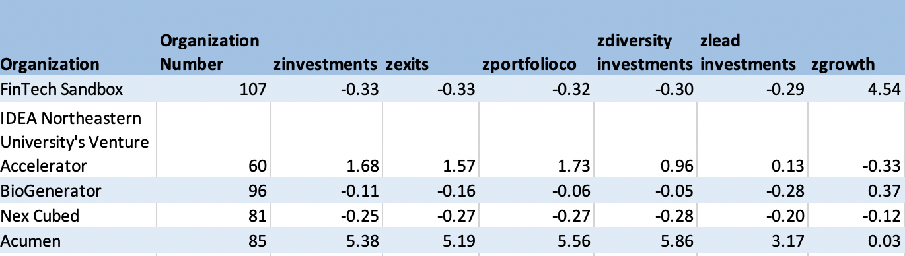
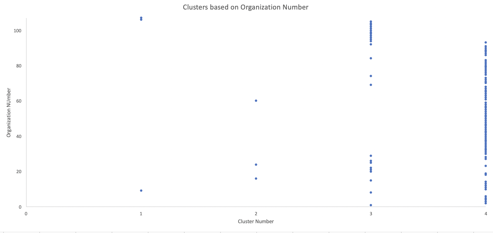
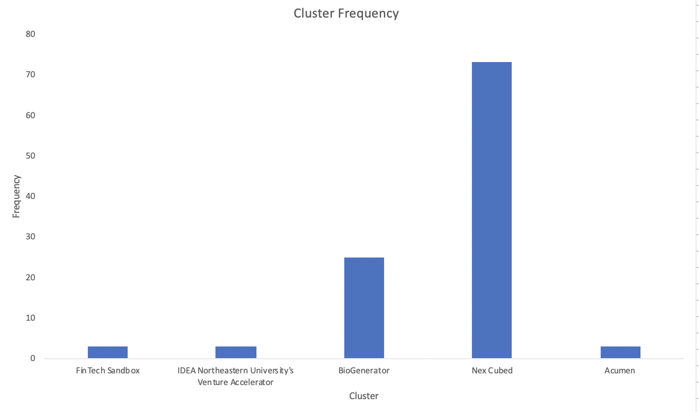

# grouping_accelerators_by_investmentmetrics
This project looks at Crunchbase investment data for accelerators and groups based on investment metrics. 

## Background
Given the [boom](https://hbr.org/2016/03/what-startup-accelerators-really-do) in venture capital funds and startup accelerators, it is often difficult for startups to choose which accelerator programs to engage and where to find funding. For startups, finding investors that have useful connections, a strong portfolio and network, and a high growth rate among other factors is important because investor relationships last at least ten years. On the flip side, investors partner with each other to share dealflow and co-invest in [syndicates](https://startupxplore.com/en/blog/basics-startup-syndicate-funding/) to bring more value to the startup and gain easier access to high-value deals. When choosing partners to coinvest with, investors often look at the same factors startups look at such as number of portfolio companies, growth rate, and successful exits. Thus, knowing what funds are well-known and have aligning values becomes important for both investors and startups. 

## Business Question
Overarching question: **How are different startup accelerators associated with each other?**

Specific question examined: **How are startup accelerators grouped based on factors including: number of investments, number of exits, growth rate, number of lead investments, number of diversity investments, and number of portfolio companies?**

## Data Exploration
To explore this question, I used data provided by [Crunchbase](https://github.com/jhu-business-analytics/excel-clustering-crunchbase) and Professor Shimano. The crunchbase data was exclusively for accelerators that provide tactical support to startups as well as investments. Although there were multiple fields of data available, I chose to look at:
  1. number of investments
  2. number of exits
  3. number of portfolio companies
  4. number of diversity investments
  5. number of lead investors
  6. growth percentage
as these fields encompass some of the key characteristics founders and other investors look at when evaluating acclerators holistically. The raw data files are in the repository. After manipulating the raw data (as explained in the Data Analysis seection below), I ran a cluster analysis on the variables with five anchors as this number of clusters seemed to give variation between the variables to further sort the data. The cluster analysis results are shown in Table 1 while the distribution of clustered organizations are in Figure 1. In this distribution, the number on the y-axis corresponds to the organization number. Figure 2 shows the frequency distribution of how many accelerators were grouped into each cluster. 

#### *Table 1: Cluster Analysis Results*

#### *Figure 1: Cluster Groupings by Organization Number*

#### *Figure 2: Frequency of Clusters*

## Results and Discussion
Table 1 shows the cluster analysis results. From this, we can see that the five anchors were FinTech Sandbox, IDEA Northeastern University's Venture Accelerator, BioGenerator, Nex Cubed, and Acumen. Interestingly, these are all relatively unknown accelerators compared to some on the list such as IndieBio, SOSV, and MassChallenge. Combined with frequency data from Figure 2, these five clusters were differentiated in a few key ways: 
  1. FinTech Sandbox anchored a cluster of accelerators that are significantly low in investments, exits, portfolio cos, diversity investment, and lead investors but much higher in growth percentage. Only two other groups were in this cluster, both with relatively unknown accelerator programs.
  2. IDEA Northwestern anchored a cluster of accelerators that are moderately high in all characteristics except growth, for which it was moderately low. Only two others are in this group, including Boost VC, a relatively well-known venture capital fund. 
  3. BioGenerator anchored a cluster with moderate results across all categories, leaning low on all but growth. There were 24 other accelerators in this group, including the accoladed YCombinator and TechStars. 
  4. Nex Cubed anchored a cluster of acclerators moderately lower across all variables, including growth. This was the largest category of 72 other accelerators, including Dorm Room Fund, Alpha Lab, and SOSV. 
  5. Acumen anchored a cluster of acclerators with significantly higher results for all variables, with only moderately high results for growth. There were only two other accelerators in this group, both of them well known: Indie Bio and Alchemist Accelerator.  

These results show most accelerators have moderate scores across the board, including those that are well known. An overwhelming majority are actually lower across the board in terms of investment number, exits, etc., which is surprising because venture funding is a dime a dozen now. It is possible that because capital is easy to come across, startups are looking less favorably upon accelerators. The biggest differentiator seems to be with growth as several groups had similar results across the other five categories but an opposite trend for growth, which may suggest that the other five categories are correlated with each other. A multivariate regression could be helpful to see the direct trends between seemingly related variables such as number of diversity investments and number of total investments. 

For startups looking at which accelerator to engage, there are a couple of suggestions to keep in mind. If the startup is looking for accelerators that emphasize diversity in their portfolio, cluster 2 and 5 are optimal and there are only a handful of accelerators to choose from. If a startup is looking for a quickly growing accelerator, clusters 1 and 3 would be the best bet. Finally, if a startup is looking for a lead investor, which is often a very important part of the funding journey, cluster 5 would be optimal and cluster 2 may have some good options. For investors looking to co-invest with accelerators, it would be most beneficial to get to know those in clusters 1, 2, and 5 as these are growing rapidly or have signficantly higher exits, indicating investment successs. Finally, it is important to note that this analysis did not evenly distribute the clusters. It is possible that there are other factors that would better distinguish the accelerators from each other. 

## Data Analysis:
To process the data I used the following steps:
1. Filter currency to only display USD with GUI-based Filter function
2. Use "Find and Replace" GUI to remove "z" from all Date-Time columns and replace with a blank space
3. Use INT(Col, "d") function to convert Date-Time columns into Date only 
4. Take difference between start date and end date after the dates are converted into date only to dislpay number of days the ad ran for
5. Use UNIQUE function on OrganizationName column to get list of individual organizations without repetition
6. From filtered list, manually determine which organizations were directly tied to a political candidate vs which organizations were independent and grassroots 
7. Use IF function to add "1" to Is Org Political column if the OrganizationName column matched any of the organizations pre-determined as political. Else add "0"
8. Generate scatterplot of Impressions vs Spending and add line of best fit (linear) with R-squared value
9. Use Data Analysis ToolPak to generate multivariate regression with Impressions as the y-variable and Length, Spending, and Is Org Political as the x-variables
10. Find which independent variables had p values that were significant (<0.05) and re-run regression on all variables that were signficant 
11. Analyze findings 
